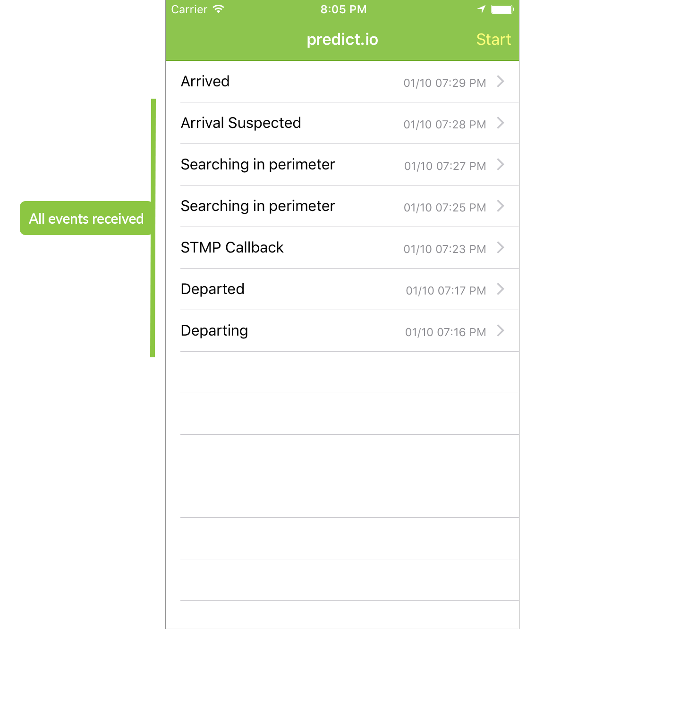
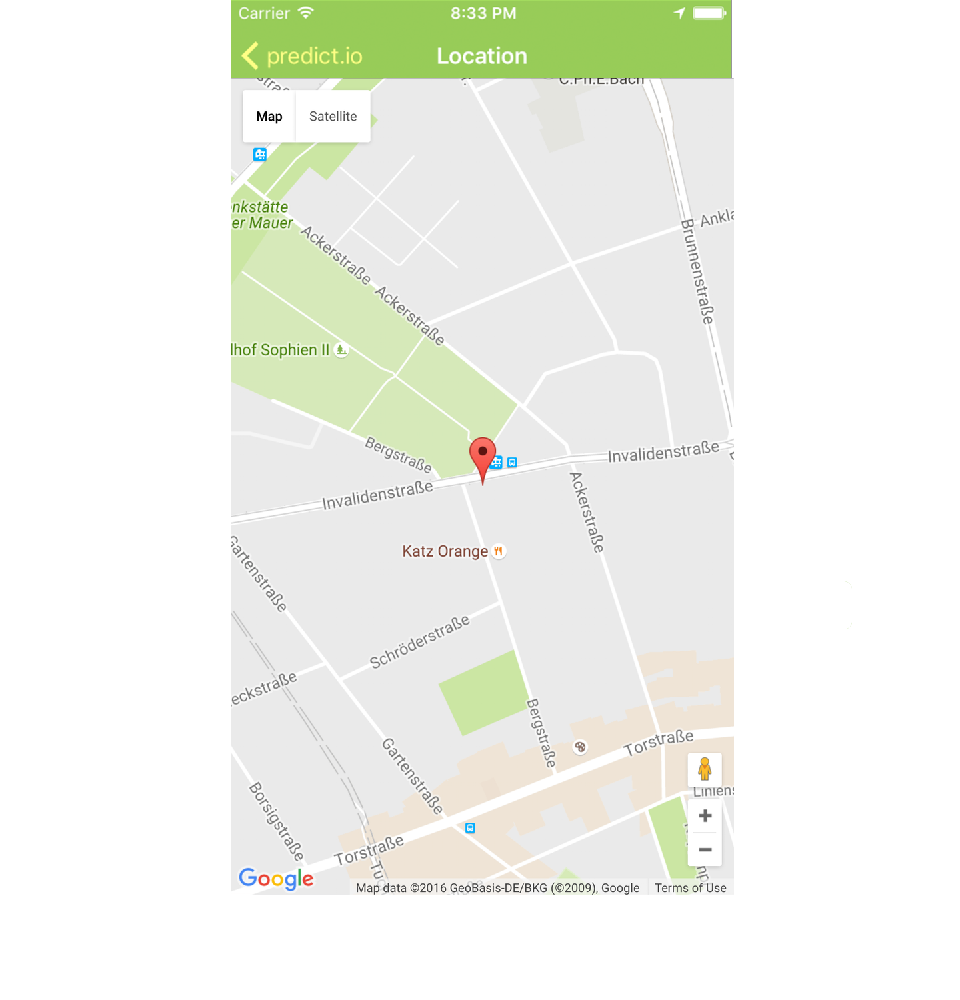

## Overview

The Example project shows how the predict.io SDK works and also how the predict.io SDK should be integrated into your Cordova app. This example app lists all events received from the predict.io SDK and can be used to test and verify the SDK performance and accuracy.

## User interface

Once you've done a test trip you'll see a list of events detected by the SDK. Tapping on a cell will show you more details about the event.

## Running and Testing

> **NOTE:** Before you build and run the Example projects, make sure you set your **API key** in **`www/js/index.js`** class.

#### Prequisites

* Install NPM & run `npm install`
* Install Cordova Plugin – `npm install -g cordova`

To build and launch the app you can use the normal Cordova CLI commands:

`cordova run ios` or `cordova run android` will build and run the app on the respective platforms, adding the `--emulator` flag will run the app in the emulator.

On the first launch of the Example App you will see an empty table view, on top-right corner tap the `Start` button to activate the SDK. The SDK will verify your API key and then will start collecting data.

### Using a Device

Start the Example App on your device, put it in your pocket or place on the dashboard. Get to your vehicle and start driving, you should get the departure event on the app in few minutes. Just drive around and then park your vehicle. After predict.io validates your trip i.e. distance travelled and duration, it will send you an arrival event.

### Remote Notifications for iOS

Apple does not support demo of push notifications with our sample app. To configure your apps and server for remote notifications go through the following available documentation for setting up push notifications,

* https://developer.apple.com/library/content/documentation/NetworkingInternet/Conceptual/RemoteNotificationsPG/APNSOverview.html#//apple_ref/doc/uid/TP40008194-CH8-SW1
* https://www.raywenderlich.com/123862/push-notifications-tutorial
* https://www.appcoda.com/push-notification-ios/
